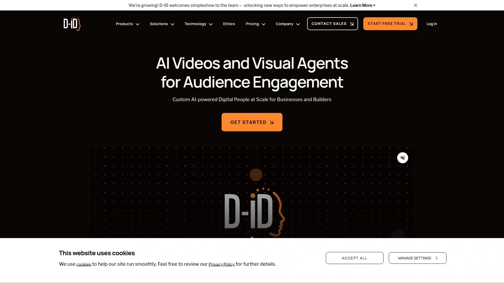

# 19 Top-Tier AI Video Generation Tools You Must Know in 2025

Creating professional videos used to require expensive equipment, actors, and weeks of production time. Now, AI video generators transform simple text or scripts into polished videos with realistic avatars, natural voiceovers, and dynamic visuals in minutes. These platforms slash video production costs by up to 90% while enabling anyone to create engaging content for marketing, training, or social media without any technical expertise or camera experience.

---

## **[HeyGen](https://heygen.com)**

Industry-leading AI video platform with ultra-realistic avatars and instant video translation capabilities.

HeyGen revolutionizes video creation by offering over 100 diverse AI avatars that look and sound remarkably human, speaking in 120+ languages with perfect lip-sync. The platform's standout feature is its video translation technology that can take any existing video and seamlessly translate it into different languages while maintaining the original speaker's voice characteristics and facial movements. This breakthrough eliminates the need for reshooting content for global audiences, saving companies thousands in localization costs.

What truly sets HeyGen apart is the ability to create custom avatars from just a 2-minute video recording of yourself or team members. The platform's text-to-video engine converts scripts into professional presentations with automatic scene transitions, background music, and branded templates. Their API integration allows businesses to generate personalized videos at scale for customer outreach, while the real-time collaboration features enable teams to work together on video projects. With rendering times under 5 minutes for most videos and an intuitive drag-and-drop interface, HeyGen makes professional video production accessible to everyone from solo entrepreneurs to Fortune 500 companies.

---

## **[Synthesia](https://synthesia.com)**

Enterprise-focused AI video creation platform trusted by 50,000+ companies worldwide.

Synthesia dominates the corporate training and communication space with its professional-grade avatars and extensive customization options. The platform offers 140+ AI avatars representing different ethnicities, ages, and professional styles, ensuring inclusive representation in corporate videos. Their unique selling point is the ability to generate videos in 120+ languages from a single script, with native pronunciation and natural gestures that match cultural communication styles.

**Key enterprise features that drive adoption:**
- Brand kit integration for consistent visual identity across all videos
- SCORM-compliant output for seamless LMS integration
- Team workspaces with role-based permissions and approval workflows
- Custom avatar creation from professional studio recordings
- Closed captioning and transcript generation in multiple formats

---

## **[Runway](https://runwayml.com)**

Creative AI suite pushing the boundaries of generative video with cutting-edge machine learning models.

Runway stands at the forefront of AI video innovation with their Gen-2 model that creates entirely new videos from text prompts or images. Unlike avatar-based platforms, Runway generates cinematic sequences, abstract visuals, and artistic content that would be impossible to film traditionally. The platform's magic tools include background removal, image animation, and style transfer that transforms ordinary footage into stunning visuals.

The collaborative workspace allows creative teams to experiment with 30+ AI tools in one interface, from motion tracking to color grading. Their mobile app brings professional video editing to smartphones, while the desktop version handles 4K exports and complex compositions. With regular model updates and an active community sharing techniques, Runway serves filmmakers, artists, and content creators pushing creative boundaries.

---

## **[Pictory](https://pictory.ai)**

Script-to-video platform that automatically transforms long-form content into engaging short videos.

Pictory excels at repurposing existing content, automatically converting blog posts, articles, and webinar recordings into shareable video clips. The platform's AI analyzes text to identify key points, then matches them with relevant stock footage from their library of 3 million+ assets. This approach creates professional-looking videos without any avatars or complex editing.

The automatic captioning feature boasts 95% accuracy while the highlight extraction tool identifies the most engaging moments from long videos for social media clips. Branded templates ensure consistency across all content while the bulk creation feature processes multiple scripts simultaneously. The platform's strength lies in content marketing, helping businesses maximize their existing written content through video transformation.

---

## **[D-ID](https://d-id.com)**

Photorealistic digital human platform specializing in talking head videos and live streaming avatars.

**Revolutionary speaking portrait technology:**

D-ID's Creative Reality™ Studio brings still images to life with their advanced facial animation technology. Upload any photo, and the platform creates a speaking video with natural head movements, blinking, and emotional expressions. Their Live Portrait feature enables real-time conversations with AI avatars, opening possibilities for interactive customer service and virtual presenters.

The platform includes 100+ premium voices, emotional expression controls, and support for 120 languages. Their API powers personalized video campaigns, generating thousands of unique videos for marketing automation. The recent addition of full-body avatars and gesture control expands creative possibilities beyond talking heads.

---

## **[Colossyan](https://colossyan.com)**

Learning-focused video platform designed specifically for corporate training and educational content.

Colossyan targets the L&D market with features tailored for instructional design. Their scenario-based learning templates create interactive training videos with branching narratives and quiz integration. The platform's conversation mode enables multiple avatars to interact naturally, perfect for demonstrating workplace scenarios or customer service training.

Automated translation maintains instructional design integrity across languages while preserving on-screen text and graphics. The platform includes SCORM export, xAPI tracking, and detailed analytics showing viewer engagement and completion rates. Integration with popular authoring tools like Articulate and Adobe Captivate streamlines existing workflows.

---

## **[Hour One](https://hourone.ai)**

Business communication platform turning text into professional presenter-led videos at scale.

Hour One focuses on business use cases with templates for product demos, HR communications, and sales enablement. Their Reals platform offers photorealistic avatars based on actual human models, ensuring authentic representation. The unique collaboration with real presenters means avatars have genuine personality and speaking styles.

The platform's workflow automation generates personalized videos from CRM data, creating custom pitches for each prospect. Built-in teleprompter mode helps subject matter experts create avatar videos using their own expertise. Enterprise security features include SOC 2 compliance, SSO integration, and dedicated cloud deployment options.

---

## **[Elai.io](https://elai.io)**

Versatile video creation platform with extensive avatar library and presentation features.

Elai combines avatar technology with presentation tools, allowing users to upload slides and automatically generate narrated videos. The platform includes 80+ avatars, custom avatar creation from webcam recordings, and voice cloning from just 1 minute of audio. Their article-to-video feature transforms written content into educational videos with automatic scene creation.

**Standout capabilities for content creators:**
- Screen recording with avatar overlay for software tutorials
- Multi-language voice cloning maintaining speaker characteristics
- Automated video translation preserving timing and context
- API access for programmatic video generation
- Interactive elements like buttons and forms within videos

---

## **[Deepbrain AI](https://deepbrain.io)**

Hyper-realistic AI human platform with industry-specific solutions and virtual production capabilities.

Deepbrain AI pushes realism boundaries with their 3D avatars that feature micro-expressions and natural body language. The platform offers industry-specific solutions for banking, retail, and media, with avatars trained on sector-appropriate communication styles. Their AI Studios platform includes chroma key support, virtual sets, and multi-camera angles for broadcast-quality production.

The conversational AI feature enables two-way interactions with avatars for customer service applications. Custom avatar development uses advanced motion capture for exact replication of human movements. The platform supports real-time rendering for live streaming applications and virtual events.

---

## **[Steve.AI](https://steve.ai)**

Automated video creation platform that converts text to animated videos with minimal user input.

Steve.AI differentiates through simplicity, automatically selecting visuals, animations, and music based on script analysis. The platform offers both animated characters and live-action stock footage, catering to different content styles. Their patented AI understands context to choose appropriate assets, reducing creation time to under 5 minutes per video.

Blog-to-video conversion maintains SEO value while creating engaging visual content. The platform includes voice customization with pitch and speed controls, automatic subtitle generation, and social media optimization. Bulk video creation processes multiple scripts simultaneously for content scaling.

---

## **[Fliki](https://fliki.ai)**

All-in-one content creation platform combining text-to-video, text-to-speech, and AI writing.

**Comprehensive content creation ecosystem:**

Fliki stands out by offering complete content creation from ideation to publication. Their AI writer generates scripts from keywords, which then convert to videos with AI voices and stock media. The platform includes 2000+ realistic voices across 75+ languages, with emotion and voice style controls for nuanced delivery.

The unique voice cloning feature requires just 2 minutes of audio to create a custom voice. Blog-to-video conversion includes automatic summarization and scene creation. The platform's strength lies in social media content, with aspect ratio templates and trending music integration for viral potential.

---

## **[InVideo](https://invideo.io)**

Template-rich video creation platform with AI-powered editing assistance and collaboration features.

InVideo combines traditional video editing with AI automation, offering 5000+ professionally designed templates for every industry and use case. Their AI assistant suggests edits, transitions, and effects based on content analysis. The platform's intelligent video assistant can create entire videos from text prompts or article URLs.

Collaboration features include real-time commenting, version control, and workflow management for team projects. The platform includes a stock library with 8 million+ assets, automated voiceover generation, and text-to-speech in multiple languages. Mobile optimization ensures videos look perfect on any device.

---

## **[Lumen5](https://lumen5.com)**

Marketing-focused video platform that transforms blog content into social media videos automatically.

Lumen5 specializes in content repurposing for marketing teams, using AI to identify key messages and match them with relevant visuals. The platform's strength lies in maintaining brand consistency with custom templates, fonts, and color schemes. Their AI analyzes text to determine optimal video length and pacing for different social platforms.

Talking head videos combine with motion graphics for dynamic presentations. The platform includes built-in media library, automated captions, and music selection based on video mood. Analytics track video performance across platforms, informing content strategy optimization.

---

## **[Rephrase.ai](https://rephrase.ai)**

Personalized video generation platform enabling businesses to create millions of customized videos.

Rephrase.ai focuses on video personalization at scale, generating unique videos for each customer using merge tags and data integration. Their digital avatars deliver personalized messages with natural variations to avoid repetition. The platform excels in sales outreach, customer onboarding, and marketing campaigns requiring individual customization.

API integration with CRM and marketing automation platforms enables triggered video generation based on customer actions. The platform includes A/B testing capabilities, engagement analytics, and conversion tracking. White-label options allow agencies to offer video personalization under their brand.

---

## **[Synthesys](https://synthesys.io)**

Professional voiceover and video creation platform with advanced voice customization options.

**Voice-first video creation approach:**

Synthesys prioritizes audio quality with their collection of 400+ ultra-realistic voices and extensive customization controls. The platform allows fine-tuning of pronunciation, emphasis, and pauses for perfect delivery. Their Humatar technology creates lifelike avatars that match voice characteristics for authentic presentations.

The platform includes lip-sync technology for existing video dubbing, making it valuable for localization projects. Cloud-based rendering handles multiple projects simultaneously while maintaining quality. The commercial license covers all generated content for business use without restrictions.

---

## **[Movio](https://movio.la)**

Mobile-first AI spokesperson video creator with real-time preview and editing capabilities.

Movio simplifies avatar video creation with an interface optimized for quick production. The platform offers 80+ AI avatars with diverse backgrounds and styles, plus custom avatar creation from photos. Their real-time preview shows changes instantly, eliminating rendering wait times during editing.

Text-to-speech supports 120+ languages with accent options for regional authenticity. The platform includes background removal, green screen effects, and branded overlay options. Mobile app functionality enables video creation and editing on smartphones for ultimate flexibility.

---

## **[Veed.io](https://veed.io)**

Browser-based video editing platform with AI-powered features for quick content creation.

Veed.io combines traditional editing with AI enhancements like automatic subtitles, translation, and background removal. Their AI avatars integrate seamlessly with uploaded footage for hybrid productions. The platform's strength lies in its simplicity, requiring no software installation while delivering professional results.

Collaboration features include commenting, sharing, and real-time editing for team projects. The platform supports screen recording, webcam capture, and audio visualization for diverse content types. Magic resize automatically adapts videos for different social media platforms.

---

## **[Kapwing](https://kapwing.com)**

Collaborative video creation platform with AI tools for modern content teams.

Kapwing focuses on team collaboration with shared workspaces, asset libraries, and brand kits. Their AI features include Smart Cut for removing silences, automatic subtitles with 97% accuracy, and background removal. The platform's scene detection automatically splits videos for easier editing.

The text-to-video feature generates videos from articles while maintaining context and flow. Real-time collaboration allows multiple editors to work simultaneously. The platform includes meme generators, video collage tools, and social media templates for viral content creation.

---

## **[Vidnoz](https://vidnoz.com)**

Free AI video generator with generous limits and professional features.

**Accessible AI video creation:**

Vidnoz democratizes AI video creation with a robust free tier including 3 minutes of video generation daily. The platform offers 100+ AI avatars, 100+ video templates, and text-to-speech in 23 languages. Their talking head feature creates videos from photos with realistic lip-sync and expressions.

The platform includes video enhancement tools like background removal, speed adjustment, and transition effects. Batch processing handles multiple videos simultaneously for efficiency. Despite being free-focused, output quality rivals premium platforms for basic video needs.

---

# FAQ Common Questions

**Q: How long does it typically take to create a professional AI video?**
A: Most platforms like HeyGen and Synthesia can generate a 2-3 minute professional video in under 5 minutes, with simple edits and script input taking just 10-15 minutes total from start to finish.

**Q: Can AI avatars really replace human presenters for corporate training?**
A: Yes, platforms like Colossyan and Hour One create training videos that achieve similar engagement rates to human presenters, with the added benefits of consistency, multilingual delivery, and instant updates when content changes.

**Q: What's the typical cost comparison between AI video creation and traditional production?**
A: AI video platforms typically cost $20-500/month for unlimited videos, while traditional video production runs $1,000-10,000 per video, representing savings of 90-95% for regular content creators.

---

# Conclusion

These 19 AI video generation platforms are transforming how businesses create and distribute video content, each offering unique strengths from photorealistic avatars to creative animation tools. The right choice depends on your specific needs, whether that's corporate training, marketing content, or creative productions. [HeyGen](https://heygen.com) particularly excels with its combination of ultra-realistic avatars, instant translation capabilities, and intuitive interface, making it ideal for businesses seeking to create professional, multilingual video content at scale without traditional production complexities.
